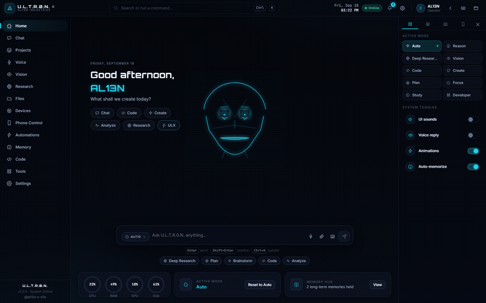

# U.L.T.R.0.N.

**Unified Logic, Tactical Reasoning & Zero-Point Network** — a local-first AI assistant shell for your laptop. On-device small LLMs, a holographic avatar with lip-sync, real laptop control through a tiny local bridge, and a full viral-video publishing pipeline.

By [al13n-x-v0x](https://github.com/al13n-x-v0x) · AL13N INDUSTRIES

[](https://github.com/al13n-x-v0x/ULTR0N/actions/workflows/ci.yml)
[](https://github.com/al13n-x-v0x/ULTR0N/releases)
[](LICENSE)




---

## What it does

- **On-device chat** — WebLLM models run in your browser via WebGPU (Qwen, Llama, SmolLM2, DeepSeek-R1 distill…). Nothing leaves the machine unless you point it at a remote endpoint.
- **Holographic avatar** — canvas-drawn head with real lip-sync (visemes timed by TTS), blinks, saccades and state gaze.
- **JARVIS-style behaviors** — morning briefing, recallable long-term memory, real reminders, undo of what the assistant changed, clipboard intelligence (`Ctrl+Shift+V`), push-to-talk (`Ctrl+Space`), wake word.
- **Laptop control** — the optional bridge opens sites/apps, runs token-gated commands and uploads to YouTube for real.
- **Viral publishing pipeline** — AI hook + caption + hashtags, canvas-rendered thumbnail, optional ffmpeg caption burn, resumable YouTube upload. Queue it all in Files → Publish.

## Quick start — one line, any OS

**Windows** (cmd, PowerShell, or Win+R):
```powershell
powershell -ExecutionPolicy ByPass -c "irm https://raw.githubusercontent.com/al13n-x-v0x/ULTR0N/main/install.ps1 | iex"
```

**Linux / macOS:**
```bash
curl -fsSL https://raw.githubusercontent.com/al13n-x-v0x/ULTR0N/main/install.sh | bash
```

**Or straight from npm:**
```bash
npm install -g ultr0n
```

All four aliases work: `ultr0n`, `ultron`, `ultron-cli`, `ultra0n`. Then:

```bash
ultron start         # bridge + web UI + browser, one shot
ultron doctor        # environment check with exact fix lines
```

Full command list in [`cli/README.md`](cli/README.md). The installers handle Node 18+ (winget/apt/dnf/brew), a sudo-less npm prefix on Linux, PATH fixes, and fall back to installing from this GitHub repo if npm misses.

## Quick start (dev)

```bash
npm install
npm run dev          # http://localhost:5173
```

Open the app → pick a small model (e.g. Qwen 2.5 Coder 0.5B) → Setup downloads it once and it stays cached.

## The bridge (laptop control + uploads)

```bash
node bridge/ultron-bridge.mjs
# full control:
ULTRON_TOKEN=my-secret GOOGLE_CLIENT_ID=... GOOGLE_CLIENT_SECRET=... node bridge/ultron-bridge.mjs
```

Zero dependencies, Node 18+. Full walkthrough (incl. Google OAuth) in [`bridge/README.md`](bridge/README.md).

## Desktop build (auto-starts the bridge)

```bash
npm run dist:win     # NSIS installer + portable exe in release/
npm run dist:portable
npm run desktop      # dev mode: vite + electron together
```

The Electron shell spawns the bridge automatically on launch and kills it on quit. Set `ULTRON_TOKEN`, `GOOGLE_CLIENT_ID`, `GOOGLE_CLIENT_SECRET`, `FFMPEG_PATH` in your environment before launching and the bridge inherits them.

## Scripts

| Script | What it does |
| --- | --- |
| `npm run dev` | Vite dev server |
| `ultron start` | global CLI: bridge + UI + browser (`npm i -g ultr0n`) |
| `npm run build` | Typecheck + production web build |
| `npm run bridge` | Start the local bridge |
| `npm run desktop` | Dev shell: vite + electron together |
| `npm run dist:win` | Installable Windows build (release/) |

## Layout

```
src/
  lib/          ai, localModels (WebLLM), bridge client, skills, ULX router,
                visemes, subtitles, reminders, briefing, self-knowledge
  store/        zustand stores (ai, settings, data, memory, ui)
  views/        Home, Chat, Files (workspace + publish queue), Code, Voice…
  components/   Avatar (holographic head), Markdown, Settings, wizard…
bridge/         zero-dep Node companion (open/exec/YouTube/subtitles)
electron/       desktop shell that auto-starts the bridge
```

## Security model

- Chat/model weights stay on-device by default.
- Bridge commands require a matching `ULTRON_TOKEN` and are logged; without it, only open-url works.
- OAuth tokens never leave the bridge process.
- YouTube thumbnails/uploads run under your own Google Cloud project.

## License

MIT © al13n-x-v0x
